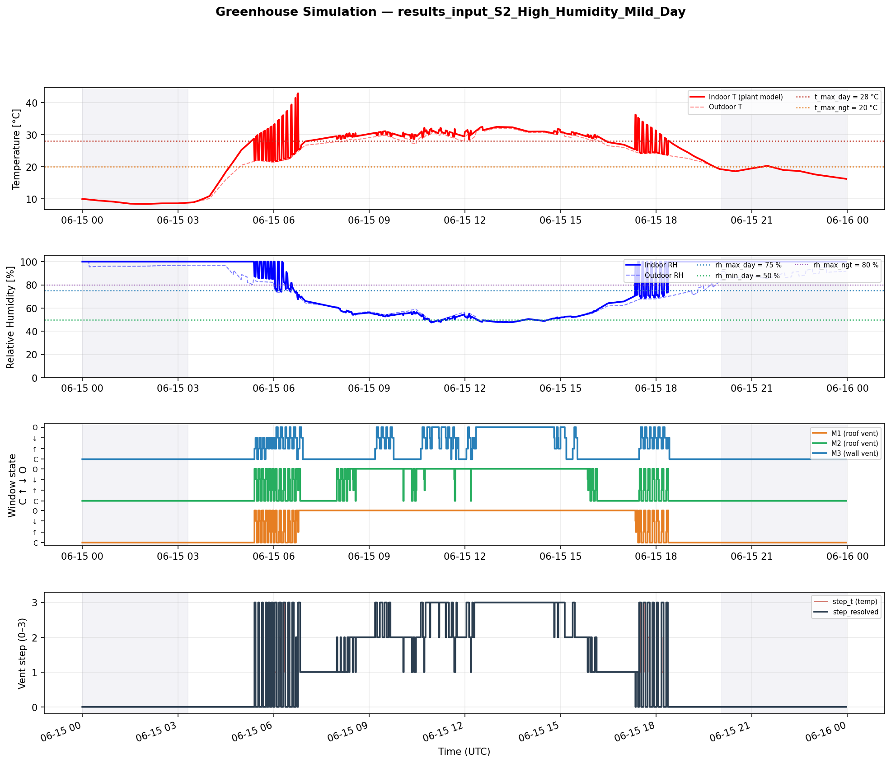
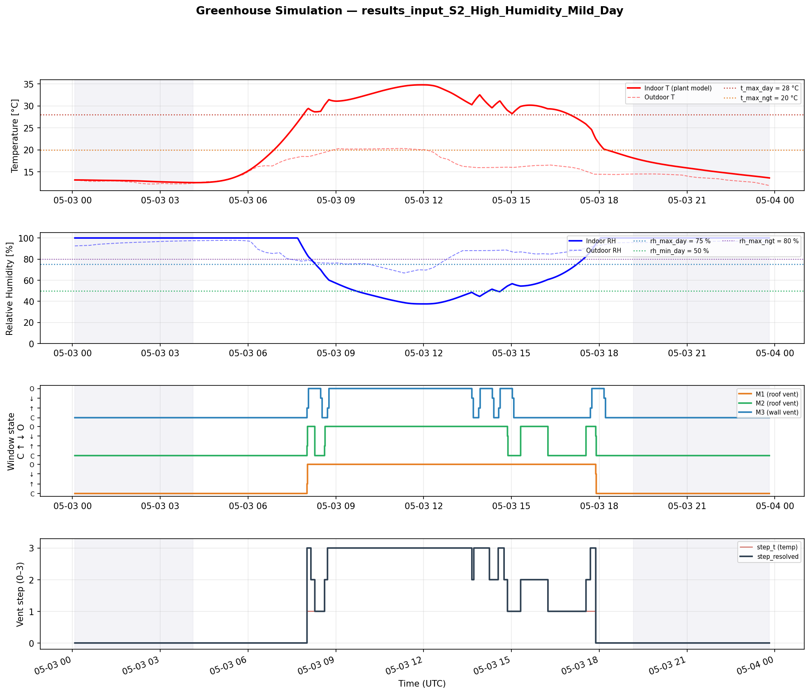

# Model — Greenhouse Controller Simulation, Tuning and Verification

This directory contains a **software model** of the greenhouse controller and the accompanying tools for **tuning** and **verifying** control parameters before they are deployed on real hardware.

---

## Purpose of this directory

The directory serves three related goals:

1. **Simulation** — a Python implementation of the same control logic as the firmware, fed with historical or synthetic weather data, with a simple physical plant model of the greenhouse. This makes it possible to walk through 24 hours or even months of greenhouse behaviour in seconds, instead of waiting for real time on the real greenhouse.

2. **Model tuning** — calibrating the plant model of the greenhouse (effective heat capacity, infiltration, transpiration, solar gain coefficient) against actually measured indoor T and RH from the real greenhouse. Only with a calibrated plant model does the simulation deliver reliable predictions of what the controller would do in a real greenhouse.

3. **Settings verification** — for every proposed change to setpoints, hysteresis, sliding average, dwell times and wind settings, it can be checked in advance whether:
   - the **objectives are met** (T and RH within the desired bands, across all weather conditions),
   - no **unwanted behaviour** appears (oscillations, delayed response, motor over-activation),
   - the **outcomes are consistent** across different scenarios (hot day, humid day, day/night cycle, sensor or motor fault).

---

## High-level overview

```
   weather data (CSV)        settings.json
        │                          │
        ▼                          ▼
   ┌────────────────────────────────────────┐
   │  simulation.py                         │
   │  ├── T5  sensor poll + sliding avg     │
   │  ├── T6  climate control (3-step)      │
   │  ├── T3  wind override                 │
   │  ├── T2  motor relay + dwell           │
   │  ├── T4  day/night (NOAA sun)          │
   │  └── plant model (T, RH first-order)   │
   └────────────────────────────────────────┘
        │                          │
        ▼                          ▼
   results_*.csv             results_*.png
   (all time series)         (4-panel plot)
```

`simulation.py` simulates the **firmware tasks T2/T3/T4/T5/T6** as faithfully as possible: same algorithms, same defaults, same command paths. Whenever the firmware source code changes in a way that affects control behaviour, `simulation.py` must change with it — otherwise the simulation and reality diverge and the model loses its value as a verification instrument.

---

## Example: oscillation discovered and removed, objectives still met

The best example of what this model does is the **oscillation investigation of May 2026**. Briefly summarised below; see `simulationOptimisation.md` for the full analysis.

### Problem (firmware v1.16.19 defaults)

In scenario **S1 — Daytime Solar Gain** (a hot sunny day, `input_S1_Daytime_Solar_Gain.csv`), the simulation model with the then-factory settings showed the following behaviour:

| Metric | Result with defaults |
|---|---|
| M1 open/close cycles in 24 h | **24** |
| Peak indoor temperature | **49.4 °C** |
| Total motor actuations | **58** |

M1 cycled open and closed every 30–60 minutes during the hot part of the day, while indoor temperature shot far above the setpoint. This was both agronomically bad (mechanical wear) and thermally counterproductive (vents closing again before the greenhouse had cooled enough). The S1 scenario plot with defaults clearly shows this sawtooth pattern:



*Figure 1 (pre-tuning) — scenario S2 (`High Humidity Mild Day`) simulated with firmware defaults. The motor traces show the rapid open/close cycling characteristic of the oscillation problem; the climate panels show that T and RH still leave their target bands.*

### Investigation

The model made it possible to test a dozen parameter combinations in minutes. The analysis identified three interacting causes (see `simulationOptimisation.md` §3):

1. **Steady-state plant effect** — an open M1 already cools the greenhouse by several degrees within a single poll cycle.
2. **Sliding-average window too narrow** — a single cold sample dominated the average and immediately triggered a close command.
3. **Firmware bug** — `CMD_CLOSE_ALL` was also used for regular climate step-down transitions, which effectively bypassed the `dwell_open_s` timer.

### Solution and verification

Three coordinated changes, all first validated in the model:

| Change | Default → Optimised |
|---|---|
| `hyst_t` (temperature hysteresis) | 3 → **5** °C |
| `avg_win_t` (sliding average T) | 3 → **6** min |
| `dwell_open_m1/m2/m3` | 120 → **300** s (M3 even 900 s) |
| Firmware `apply_step_delta()` | `CMD_CLOSE_ALL` → per-channel `CMD_CLOSE` |

Result on the same S1 scenario:

| Metric | Defaults | Optimised | Improvement |
|---|---|---|---|
| M1 open/close cycles | 24 | **1** | −96 % |
| Peak indoor T | 49.4 °C | **35.7 °C** | −13.7 °C |
| Total actuations | 58 | **6** | −90 % |



*Figure 2 (post-tuning) — same scenario S2 simulated with `settings_optimised.json` and the firmware fix. Each motor opens and closes only as needed for the natural day/night humidity rhythm; T and RH remain within their bands. Same control objectives as Figure 1, but without the oscillation.*

The **objectives are still met**: the greenhouse is ventilated as soon as T crosses the setpoint, M1 stays open throughout the hottest period, and closes cleanly in the evening as outdoor temperature drops. But the **oscillation is fully gone** — the controller responds calmly and proportionally.

The optimised firmware was released as **v1.16.22** (the bug fix) and **v1.16.23** (the new defaults).

---

## Files in this directory

### Main tools

| File | Purpose |
|---|---|
| `simulation.py` | The simulator itself. Implementation of the firmware control logic + plant model. CLI: `python simulation.py <weather.csv> [settings.json]` |
| `simulation_manual.md` | Full user manual for `simulation.py`: input formats, output formats, parameter overview, plot explanation |
| `simulationOptimisation.md` | Full analysis report of the oscillation investigation (May 2026). Contains root-cause analysis, intermediate results and the final fix |
| `calibrate_plant.py` | Fits the plant model (effective heat capacity, transpiration, infiltration, solar gain coefficient) against real LHT65 sensor logs in `srcData/`. CLI: `python calibrate_plant.py [--plot]` |
| `generate_inputs_from_live.py` | Generates the five scenario CSVs (`input_S1`..`S5`) by selecting 24-hour slices from real sensor logs in `srcData/` |

### Settings files

| File | Purpose |
|---|---|
| `settings.json` | Default settings — matches the firmware factory defaults |
| `settings_optimised.json` | Optimised settings for "general crops" (after the oscillation investigation). Contains the `hyst_t=5`, `avg_win_t=6`, `dwell_open` 300/300/900 s changes |
| `new_settings_calibrated.json` | Settings after a fresh plant calibration against recent sensor logs |

### Plant-model files

| File | Purpose |
|---|---|
| `plant_general_crops.json` | Plant-model parameters for a typically cropped greenhouse (moderate biomass, active soil, glazing) |
| `plant_calibrated.json` | Plant-model parameters after automatic fit by `calibrate_plant.py` |
| `plant_empty_greenhouse.json` | Plant model for an empty greenhouse (no transpiration, low thermal mass) — reference / baseline |

### Scenario inputs (5 weather-data CSVs + per-scenario description)

| Scenario | Files | Profile |
|---|---|---|
| **S1** | `input_S1_Daytime_Solar_Gain.csv` + `.md` | Clear day, strong solar irradiance, T peak 34 °C, RH drops to 33 % |
| **S2** | `input_S2_High_Humidity_Mild_Day.csv` + `.md` | Overcast, T peak 32 °C, RH structurally >75 % |
| **S3** | `input_S3_Full_24h_Day-Night_Cycle.csv` + `.md` | Symmetric day/night cycle, NOAA sunrise/sunset tested |
| **S4** | `input_S4_T_Below_Setpoint_RH_Critical.csv` + `.md` | Cold foggy morning, T 5–8 °C, RH 95–100 % — pure RH ventilation |
| **S5** | `input_S5_Motor_Stall_M2.csv` + `.csv.md` | Rapid morning warm-up to 35 °C, simultaneous T and RH activity |

### Real historical weather data

| File | Purpose |
|---|---|
| `airTemperature_2025-05-01_to_2025-09-01.csv` | Four months of outdoor air temperature, suitable for long-duration runs and seasonal analysis |
| `srcData/greenhouseClimate-LHT65-02_2026-03-17_to_2026-05-07.csv` | Indoor climate of greenhouse 2 from the real LoRaWAN sensor LHT65-02 |
| `srcData/greenhouseClimate-LHT65-03_2026-03-17_to_2026-05-07.csv` | Indoor climate of greenhouse 1 from LHT65-03 |
| `srcData/greenhouseClimate-lht65-20_2026-03-17_to_2026-05-07.csv` | Outdoor reference sensor LHT65-20 (T, RH, luminosity) |
| `srcData/sql.md` | SQL queries and metadata describing how the srcData archives were generated |

### Results (output of `simulation.py`)

Per scenario, a simulation run produces two files: a CSV with all time series (sensor, window and mode state per time step) and a 4-panel PNG plot.

| File | Contents |
|---|---|
| `results_input_S1_Daytime_Solar_Gain.csv` + `.png` | Result for scenario S1 |
| `results_input_S2_High_Humidity_Mild_Day.csv` + `.png` | Result for scenario S2 |
| `results_input_S3_Full_24h_Day-Night_Cycle.csv` + `.png` | Result for scenario S3 |
| `results_input_S4_T_Below_Setpoint_RH_Critical.csv` + `.png` | Result for scenario S4 |
| `results_input_S5_Motor_Stall_M2.csv` + `.png` | Result for scenario S5 |
| `results_airTemperature_2025-05-01_to_2025-09-01.csv` | Result of the seasonal run |

### Calibration output

| File | Contents |
|---|---|
| `calibrate_plant_LHT65-02_kas2.png` | Plant-model fit-vs-measurement plot for greenhouse 2 |
| `calibrate_plant_LHT65-03_kas1.png` | Plant-model fit-vs-measurement plot for greenhouse 1 |

### Reference snapshots

| File | Contents |
|---|---|
| `default/` | Snapshot of all `results_*` files generated with `settings.json` (firmware-default settings). Serves as the reference against which optimised runs are compared |
| `simulation.zip` | Compressed snapshot of an earlier release |

---

## Workflow for settings verification

If you want to propose a new set of parameters — for example a higher `hyst_t` or a different dwell regime — this is the recommended procedure:

1. **Plant model up to date?** If the greenhouse has changed recently (crop, glazing, insulation): run `python calibrate_plant.py --plot` with recent sensor logs in `srcData/` and visually compare the fit PNG.
2. **Write the proposed settings** in a new JSON file, e.g. `settings_proposal.json`, with the same structure as `settings_optimised.json`.
3. **Run all five scenarios**:
   ```
   python simulation.py input_S1_Daytime_Solar_Gain.csv settings_proposal.json
   python simulation.py input_S2_High_Humidity_Mild_Day.csv settings_proposal.json
   python simulation.py input_S3_Full_24h_Day-Night_Cycle.csv settings_proposal.json
   python simulation.py input_S4_T_Below_Setpoint_RH_Critical.csv settings_proposal.json
   python simulation.py input_S5_Motor_Stall_M2.csv settings_proposal.json
   ```
4. **Compare** each `results_input_S*.png` with the baseline in `default/` and with `results_input_S*.png` for the current `settings_optimised.json`. Watch for:
   - **Number of motor cycles** per channel — should not rise sharply
   - **Peak indoor T** — should not rise
   - **Time between opening and closing** — oscillation shows up as <30 min cycles
   - **RH limits** — RH must not stay above `rh_max` or below `rh_min` for long
5. **Document** your findings in a new markdown file in this directory (analogous to `simulationOptimisation.md`).
6. **Apply to the firmware** by updating `firmware/config/cfg_defaults.h` or the web interface, then run the **integration test** from `test/` on the real hardware.

---

## Relation to firmware and hardware

| In this directory | In the firmware |
|---|---|
| `simulation.py` plant model | `firmware/src/climate_control/climate_control.cpp` (T6) |
| `simulation.py` `apply_step_to_motors()` | `firmware/src/climate_control/climate_control.cpp::apply_step_delta()` |
| Sliding average in `simulation.py` | `firmware/src/data_manager/` (T5/T4 averaging) |
| `settings.json` defaults | `firmware/config/cfg_defaults.h` |
| `settings.json` ranges | `firmware/config/cfg_limits.h` |
| `settings_optimised.json` | Not directly in the firmware — reference for what `cfg_defaults.h` should become at the next update |

A discovered improvement can reach production via two paths:

- **For existing installations**: via the web interface (Climate, Wind, Motors tabs) — admin applies the optimal settings per greenhouse; these persist in NVS
- **For new installations / factory reset**: via a firmware release with adjusted `cfg_defaults.h` values — appears automatically after flashing

---

## Known limitations

- **First-order plant model**: fine for control-tuning, but not for in-depth HVAC engineering. No spatial gradients, no stratification, no per-zone leakage paths
- **Constant plant parameters per run**: transpiration in reality changes with time of year, crop stage, and irrigation. Recalibrate periodically
- **No wind-pressure effect on ACH**: the ACH (air changes per hour) per opened vent is constant; in reality it rises with wind speed. Sufficient for wind-override validation, but an underestimate at strong wind for ventilation-capacity tuning
- **Wind override is modelled**, but its effect on indoor RH after a forced close in humid conditions must be inspected manually in the PNG plot

---

## Further documentation

- **`simulation_manual.md`** — full user manual for `simulation.py`
- **`simulationOptimisation.md`** — analysis report of the oscillation investigation (reference for future tuning work)
- **`input_S*.md`** — per-scenario description: what it tests, which meteo condition it simulates, and why that scenario is relevant
