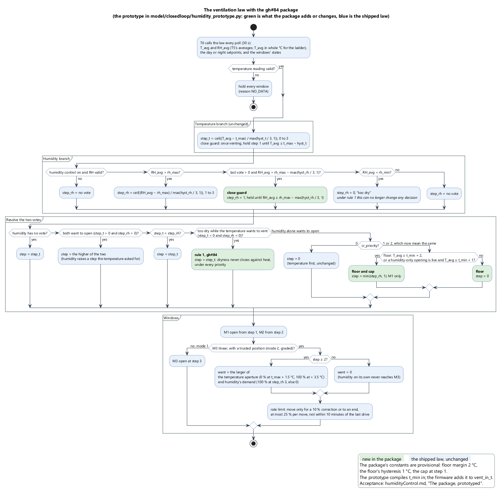

# Humidity control: what the branch asks for, and what it gets

| Field | Value |
|---|---|
| Subject | The humidity branch of the stepped law — [`vent_model_stepped.cpp:184`](../../drivers/ventModel/src/vent_model_stepped.cpp) — and the conflict rule that decides what happens to its vote (`:213`). Mode 1 and mode 2 share both |
| Status | **An audit, 2026-09-24; mode 2 added and the fix prototyped 2026-09-27.** Nothing here is implemented in the firmware; the fix exists as a separate build in the simulator and passes all eight acceptance criteria (*The package, prototyped*). The one hazard is filed as [gh#84](https://github.com/pe1mew/greenhouse-Controller/issues/84) and reaches mode 2 (*Lineair*, the factory default since 2.13.0) unchanged; the rest is a proposal with costs attached, for the operator to accept or drop |
| Evidence | 5C88's SD logs, 2026-06-04 09:35 to 2026-09-23 07:30 — 61 files, 312 543 samples, 109.1 days — driven through the compiled law with 5C88's own settings. The Python mirror the variants vary from is checked against the DLL on **every** sample: 0 mismatches. No rig run, no greenhouse run |
| Scope | The demand layer only: the step the law asks for, before dwell, wind override, the EG1 inhibit mask or a sensor fault get a say |
| Regenerate | `python model/closedloop/humidity_audit.py` (about a minute); the closed-loop tables with `humidity_closedloop.py` (about 20 minutes); the prototype with `humidity_prototype.py rules` (seconds), `floor` (about 18 minutes) and `loop` (about 27 minutes) |

## Short answer

- **The humidity axis cannot open a window at all under the shipped defaults**, and that is deliberate: `cr_priority` 0 is standing in for a temperature floor that was never wired.
- Over 109 days it asked to vent while the temperature was idle for **1203.9 h — 46 % of the time, 11 h a day — and was refused every time.** 869 h of that was a demand for *every* window.
- What it does instead is raise a step the temperature already asked for: **285.3 h, 2.6 h a day.** That is the entire effect of humidity control on this greenhouse.
- **No setting changes this.** `rh_max`, `rh_min`, `hyst_rh` and `avg_win_rh` only shape a vote that gets discarded. Of the two settings that do change it, one (`cr_priority` 1) is a hazard — [gh#84](https://github.com/pe1mew/greenhouse-Controller/issues/84) — and the other (`cr_priority` 2) hands an unbounded, unfloored authority to a setpoint the house cannot meet.
- **The night ceiling is not reachable.** Night RH runs at a median of 89 % against an 80 % ceiling, p10 83 %. The humidity axis is pegged at step 3 most of every night.
- **Both non-default priorities cost the crop, in both modes.** In the closed loop, `cr_priority` 1 doubles the hours above 31 °C (2.4 → 4.4 a day in mode 2) *and* the night hours below 14 °C (1.2 → 2.4); `cr_priority` 2 costs the nights only. Mode 2 inherits all of it — see *Mode 2, and what each priority costs*. Priority 0, today's default, is the only setting with neither failure.
- **Venting would have removed water, though — nearly always.** Against the outdoor sensor, the air outside held less water than the air inside in **99.6 % of the refused hours**, by a median of 2.20 g/m³. Venting offered a 3.03 K lower dewpoint for a 3.04 K lower air temperature. That is the argument for giving the axis authority, and the argument for putting a floor under it.

## Why the axis is inert

`cfg_defaults.h:53` says it in as many words:

```c
#define DEF_CR_PRIORITY  0  /**< 0 = CR_TEMP_FIRST (preserves T-floor protection on cool humid nights) */
```

There is no T-floor. `t_min` (16 °C day, 14 °C night) is stored, published over `/api/config`, editable on the LCD, logged as `LOG_PARAM_T_MIN_DAY` — and **read by no control path**. `cfg_defaults.h:38` calls it "informational; future heating" and `ui_display.cpp:179` keeps it out of the day/night parameter list with the comment `HEATING CONTROL NOT IMPLEMENTED`. What actually keeps the house from venting on a cold damp night is that temperature-first discards every humidity demand while the temperature is below its setpoint.

So the default is not a preference between two axes. It is a missing feature being covered by a priority setting, and the cost is that the other axis never acts.

A second claim in the same file does not hold either. `cfg_defaults.h:51` gives `hyst_rh` = 12 as a "wider RH dead band — suppresses small-signal step toggles". The humidity branch has **no dead band**: `vent_step_required_rh()` enters the ladder only when `rh_avg > rh_max`, so the close guard inside `step_from_deviation()` (`:151`, reached only at a deviation of zero or less) is unreachable from it. `hyst_rh` sets the step width — 4 % RH per step — and nothing else. The vote lapses the instant the average touches the ceiling.

## What the house actually does

RH as the law sees it, 10-minute average, whole percent:

| | p10 | median | p90 | at or above 90 % |
|---|---:|---:|---:|---:|
| day | 42 | 70 | 90 | 10.7 % |
| night | 83 | **89** | 92 | 43.6 % |

109.1 days, 2618 h analysed, 5C88's own settings (`t_max` 28/20, `rh_max` 75/80, `rh_min` 50/55, `hyst_t` 5, `hyst_rh` 12, `avg_win` 6/10 — the shipped defaults, unchanged since commissioning; 2 climate `SETPT` rows in the whole period):

| | hours | share | per day |
|---|---:|---:|---:|
| temperature asks to vent | 1319.6 | 50.4 % | 12.10 |
| — at step 1 | 859.8 | 32.8 % | 7.88 |
| — at step 2 | 140.9 | 5.4 % | 1.29 |
| — at step 3 | 318.9 | 12.2 % | 2.92 |
| RH above its ceiling | 1608.1 | 61.4 % | 14.74 |
| — by day | 715.4 | 27.3 % | 6.56 |
| — at night | 892.7 | 34.1 % | 8.18 |
| **humidity asks to vent, temperature idle (refused)** | **1203.9** | **46.0 %** | **11.04** |
| — by day | 676.7 | 25.8 % | 6.20 |
| — at night | 527.2 | 20.1 % | 4.83 |
| — asking step 1 (M1) | 86.1 | 3.3 % | 0.79 |
| — asking step 2 (M1+M2) | 248.3 | 9.5 % | 2.28 |
| — **asking step 3 (everything)** | **869.4** | **33.2 %** | **7.97** |
| — at or above `t_min` | 1037.6 | 39.6 % | 9.51 |
| — — by day (the narrowest useful authority) | 616.1 | 23.5 % | 5.65 |
| — — at night | 421.5 | 16.1 % | 3.86 |
| — below `t_min` (a floor would refuse these too) | 166.2 | 6.3 % | 1.52 |
| what humidity does today: raises a live step | 285.3 | 10.9 % | 2.62 |
| dry house while temperature wants to vent | 354.1 | 13.5 % | 3.25 |
| — by day | 353.7 | 13.5 % | 3.24 |
| — at night | 0.5 | 0.0 % | 0.00 |

Two things stand out. The refused demand is mostly **step 3** — 8 hours a day of "open everything", half of it at night. And it grows through the season: September asks for 13 h a day against June's 7.8, so whatever is decided here matters most in the months the campaign barely covers.

| month | days | refused, at or above `t_min` | per day |
|---|---:|---:|---:|
| 2026-06 | 26.6 | 206.9 h | 7.78 |
| 2026-07 | 29.2 | 243.3 h | 8.34 |
| 2026-08 | 31.0 | 297.2 h | 9.59 |
| 2026-09 | 22.3 | 290.2 h | 13.01 |

The temperature during the refused demand says how much of it a floor would catch:

| T_avg | hours | per day |
|---|---:|---:|
| below 10 °C | 0.6 | 0.01 |
| 10–13 | 126.5 | 1.16 |
| 14–15 | 227.1 | 2.08 |
| 16–19 | 397.2 | 3.64 |
| 20–23 | 279.3 | 2.56 |
| 24 and up | 173.0 | 1.59 |

**On the averaging windows.** The table above uses the config snapshot's `avg_win_t` 6 and `avg_win_rh` 10. `model/vent_step_replay.py` does not agree with the first: replayed against the same logs, a 3-minute temperature window reproduces **97.9 %** of 5C88's 2 268 logged T-demands and the snapshot's 6 minutes only **63.2 %**, so either the unit runs 3 or the snapshot postdates a change — worth reading off `GET /api/config` before acting on it. It does not move anything here: re-run at 3/5, the refused hours are 1200.2 against 1203.9, the raised steps 291.3 against 285.3, every headline within 2 %.

A floor at `t_min` removes 166 h of 1204 — 14 %. In June–September that is nearly nothing, because the house is rarely cold. In November it is most of it. **The summer campaign is the wrong season to size a floor against**, and there is no winter data.

## What the settings can and cannot do

| setting | effect on "can humidity open a window" |
|---|---|
| `rh_max`, `rh_min` | none — they move the threshold of a vote that is then discarded |
| `hyst_rh` | none — it is the step width only (see above), not a dead band |
| `avg_win_rh` | none — it smooths the reading |
| `rh_ctrl_en` | turns the vote off entirely |
| `cr_priority` 1 | yes, and it also lets a **dry** house close against a heat demand: 354 h over 109 days, 220 h of it while the temperature was asking step 3. At the tomato row's own `rh_min` of 60 it is 568 h. In the closed loop that doubles the hours above 31 °C, and humidity opening at night doubles the night hours below 14 °C. Filed as [gh#84](https://github.com/pe1mew/greenhouse-Controller/issues/84) — the crop tables recommend this setting for tomato and strawberry |
| `cr_priority` 2 | yes: 11 h a day more venting, 8 of it at step 3, 4.8 of it at night, with no floor and no cap. No heat penalty, but the same doubled cold nights as priority 1 |

So the answer to "should the defaults change" is **no, not as the law stands**. Priority 2 is the only setting that unlocks the axis, and it unlocks it without either of the two brakes the audit says it needs.

## Would venting have dried the house?

The question the ceiling exists for, and it is answerable: `lht65-20` (*buiten kas*) logs outdoor T and RH through the campaign. Joined to the refused hours — UTC to local through `lora_time.utc_to_local()`, the conversion the 2026-09-18 erratum installed, forward-filled, stale after 1800 s — 1093.1 h of the 1203.9 h match (91 %; the rest is the fall period, which the export does not cover, and gaps).

| | matched hours |
|---|---|
| outside air holds **less** water than inside | **99.6 %** (day 99.7 %, night 99.4 %) |
| outside dewpoint is lower than inside | 99.6 % |
| median AH_in − AH_out | **2.20 g/m³** |
| median dewpoint drop on offer | 3.03 K |
| median T_in − T_out — the heat paid for it | 3.04 K |

So the intuition that an unheated house cannot vent its way dry is **wrong for this house, in this season**: opening a window during the refused hours would almost always have removed water, night included. What it also does is cost about 3 K of air temperature, which is why the floor in item 1 below is not optional — and why the axis asking for step 3 for 8 h a day is not a good way to spend it.

What this does **not** settle is the crop. Venting drops the dewpoint and the air temperature by about the same 3 K, and whether that leaves a leaf further from or closer to condensation depends on the leaf's own temperature, which nothing here measures — at night a leaf radiating to a clear sky sits below air temperature. The moisture balance is measured; the condensation verdict is not.

## Mode 2, and what each priority costs

`graded`, mode 2's law, embeds the stepped law rather than copying it (`vent_model_graded.cpp`, *Why it embeds the stepped law*): "the humidity branch and cr_priority are the stepped model's own code". So everything above holds in mode 2, and one thing is added — M3 is gated on the step that resolver returns:

```c
int want = 0;
if (out->step >= 2) {
    want = (a_rh > a_t) ? a_rh : a_t;
}
```

With `cr_priority` 1 and a dry house the resolved step is humidity's 0, so M3's target is 0 whatever its temperature aperture `a_t` says. M1 and M2 close as soon as their dwell allows. M3 does not slam shut: `m3_linear()` rate-limits the close, 25 % per move with a 10-minute hold, so from fully open it walks shut over about half an hour, the last move an end drive into the switch (gh#83). The way back is limited the same way.

**What it would have cost.** `humidity_closedloop.py`: the closed loop over 5C88's summer (2026-06-05 to 09-16, primary plant, today's firmware emulation, humidity from the log), `p` for `cr_priority`, and the *tomato* columns on the manual's whole tomato row — `t_max` 26/18, `rh_max` 75/80, `rh_min` 60/65:

| by day | mode 1 p0 | mode 1 p1 | mode 2 p0 | mode 2 p1 | mode 2 p2 | tomato p0 | tomato p1 |
|---|---:|---:|---:|---:|---:|---:|---:|
| hours ≥ 31 °C a day | 2.3 | **4.2** | 2.4 | **4.4** | 2.4 | 2.0 | **4.3** |
| hours ≥ 35 °C a day | 0.7 | **2.8** | 0.7 | **2.9** | 0.7 | 0.7 | **2.9** |
| mean daily maximum, °C | 32.0 | 36.1 | 31.9 | 36.2 | 31.7 | 31.2 | 36.0 |
| daytime mean, °C | 27.4 | 28.9 | 27.5 | 29.0 | 26.8 | 27.0 | 28.8 |
| dry-close hours a day | 0.0 | 5.1 | 0.0 | 5.1 | 0.0 | 0.0 | 5.3 |
| longest dry-close episode, h | 0.0 | 11.5 | 0.0 | 11.5 | 0.0 | 0.0 | 12.1 |
| M3 open hours a day | 4.4 | 9.5 | 5.7 | 10.6 | 14.3 | 9.1 | 12.0 |
| M3 drives a day | 7.5 | 7.9 | 20.7 | 22.2 | 32.5 | 28.5 | 27.8 |

| by night | mode 1 p0 | mode 1 p1 | mode 2 p0 | mode 2 p1 | mode 2 p2 | tomato p0 | tomato p1 |
|---|---:|---:|---:|---:|---:|---:|---:|
| mean nightly minimum, °C | 15.2 | 14.1 | 15.2 | 14.1 | 14.1 | 14.8 | 14.1 |
| coldest night, °C | 9.5 | 6.9 | 9.5 | 6.9 | 6.9 | 9.5 | 6.9 |
| night hours below 14 °C a day | 1.3 | **2.4** | 1.2 | **2.4** | **2.4** | 1.6 | **2.4** |
| night hours below 12 °C a day | 0.3 | 0.9 | 0.3 | 0.9 | 0.9 | 0.3 | 0.9 |
| M3 open at night, h a day | 0.9 | 4.9 | 1.1 | 5.2 | 5.2 | 3.1 | 5.9 |

Read it as two failures, not one. **By day**, priority 1's dry close roughly doubles the hours above 31 °C and quadruples those above 35 °C, in both modes; mode 2 comes out marginally worse, because the slow way back open lengthens every episode. **By night**, the temperature axis is idle and humidity is over its ceiling most of the time (median 89 %), so "humidity first" and "the higher step" both open the house — twice the hours below 14 °C, and the coldest night 2.6 K colder. That is summer; spring and autumn nights are colder. The tomato row wants 16–18 °C at night.

The baseline reproduces the log where the log can check it — a 42.6 °C peak against 42.2 °C logged (2026-06-26), 0.7 h a day at or above 35 °C against 0.75 — so the plant is calibrated to about 42 °C. Priority 1's 48.8 °C is 6.6 K past anything observed: read it as "outside the known range", not as a forecast. The hour counts at 31 and 35 °C sit inside it.

**Why a dry close would not end itself.** A shut house traps the crop's transpiration, which could lift RH back over `rh_min` and reopen it. `humidity_audit.py` measured what a warm, shut house actually did, against the same temperatures open:

| daytime, 20 minutes | n | T0, median | dT | dRH | dAH, g/m³ |
|---|---:|---:|---:|---:|---:|
| shut, T0 ≥ 24 °C | 495 | 25.4 | +0.60 | **−1.0 %** | **+0.44** |
| open, T0 ≥ 24 °C | 2495 | 29.3 | −0.30 | +0.0 % | −0.15 |
| shut, T0 ≥ 26 °C | 169 | 26.6 | +0.20 | +0.0 % | +0.10 |
| open, T0 ≥ 26 °C | 2214 | 29.7 | −0.30 | +0.0 % | −0.16 |

Wetter in absolute terms, not in relative ones: the warming outpaces the moisture, so the dry reading persists while the house heats. The situation itself — shut while hot and dry — occurs **0 times** in the log, because priority 0 prevents it; these are warm mornings, the nearest thing the log has. At the demand layer, priority 1 would have made 295 dry closes in 109 days (2.7 a day, 72 minutes each), up to 17 on one day (2026-06-25): the dry vote has no hysteresis at `rh_min` either, so a reading on the floor flips the whole house.

**It is specified, not an accident.**
- Two host tests assert it as correct: `test_too_dry_demands_close_and_priority_decides` in the stepped suite (30 °C, RH under `rh_min`, priority 1: step 0) and `test_conflict_follows_cr_priority` in the graded suite (step 3, 40 % RH, priority 1: step 0, M3 held shut). A fix turns both red on purpose; their expectations change with it, deliberately.
- The FRS permits it: FR-CR03 says "RH takes priority" and no more. A fix narrows FR-CR03 in the same change.
- FR-CR04 asks that a conflict be logged or displayed "so the farmer is aware of the trade-off". The law computes `STEPPED_REASON_CONFLICT`, but only the serial console sees it (`climate_control.cpp:842`). The SD row carries `step_t`, `step_rh` and the resolved step, so a dry close can be reconstructed afterwards; nothing flags it, and nothing shows it.

**gh#84's first fix makes priority 1 and 2 the same.** "Dryness may not close against heat" removes the one conflict where they differ. Afterwards: hot and dry gives the temperature's step under both; cool and humid gives humidity's step under both, since 2 takes the higher. FR-CR03's three choices become two unless priority 1 is given another meaning.

**Which setting, until the law changes:**

| | heat by day (gh#84) | cold by night | humidity opens on its own |
|---|---|---|---|
| `1`, the crop tables' advice today | **yes** | **yes** | yes |
| `2` | no | **yes** | yes |
| `0` | no | no | no |

Priority 0 is the only setting with neither failure. What it gives up — humidity opening the house on its own — is exactly what neither alternative can do safely today.

## What would have to change

All of it inside `drivers/ventModel`, behind [`ventModelContract.md`](../../design/ventModelContract.md), with `pio test -e native` and this audit re-run. Ranked cheapest first; each is independently useful.

1. **Wire `t_min` as the floor under a humidity-only open — at `t_min` + 2 °C, holding to `t_min` + 1** (the prototype's finding, below: at `t_min` itself the nights still got colder). No new config key, already per-crop in both manuals, and it restores the protection `cr_priority` 0 is currently faking. Measured on this data it withholds 166 h of 1204; in winter it is the whole point. The cost is an interface change: `vent_in_t` carries no `t_min` today, so the law needs a new field (interface 3), T6 passes it, and the host tests and `ventmodel.py`'s mirror follow.
2. **Cap a humidity-only demand at step 1, or 2.** Its refused demand is step 3 for 8 h a day. M3 wide open on a damp night is a heat dump, not a dehumidifier — and in mode 2 that demand is all-or-nothing on M3 (`vent_model_graded.cpp:175`), so it goes to 100 % or nowhere.
3. **Give the branch a real close guard**, so `hyst_rh` means what `cfg_defaults.h:51` already claims. The cost is the hours the vote is held open below the ceiling:

   | guard | vote flips | per day | vote open | held below the ceiling |
   |---|---:|---:|---:|---:|
   | shipped (none) | 416 | 3.81 | 1608.1 h | 0.0 h |
   | 3 % | 316 | 2.90 | 1640.1 h | 32.0 h |
   | **4 % (`hyst_rh`/3, the ladder's own width)** | **298** | **2.73** | 1655.3 h | **47.2 h** |
   | 5 % | 282 | 2.59 | 1666.9 h | 58.7 h |
   | 12 % (`hyst_rh` whole) | 232 | 2.13 | 1751.4 h | 143.3 h |

   4 % is the natural choice: it costs 47 h in 109 days and cuts a quarter of the flips. The full 12 % would hold the vote open down to 63 % RH, which in this house is nearly permanent. Today the flips are free because priority 0 discards them; the moment humidity can open a window, each one is a motor cycle.
4. **Dryness never closes against heat**, under every priority — gh#84, in `vent_resolve_conflict()`. One change covers both modes, since `graded` calls the stepped law; its lockstep test keeps them together. On its own it makes priority 1 identical to 2 (above), and with no floor both still chill the nights, so it is not a fix for the crop tables without item 1.
5. **Decide what the 3 K is worth, and spend it deliberately.** Night authority is defensible on the moisture balance — the outside air is drier 99.4 % of those hours — but it costs about 3 K of house temperature and an unmeasured amount of leaf cooling. The conservative shape is floored, capped at M1, and day-only: **5.65 h a day** of extra M1 against 11 h a day of everything. The wider shape needs a leaf-temperature measurement, or a season of trying it on one unit.
6. **Then say what `cr_priority` means.** With items 1–4 in, the only choice left is whether humidity may open the house on its own: 0 no (the default, unchanged), 1 yes — floored at `t_min`, capped at M1. Keeping 2 as an alias of 1 needs no key or NVS change, old settings keep working, and FR-CR03 becomes two choices. The crop tables can then recommend `RH` safely.

## The package, prototyped

`humidity_prototype.py` builds items 1–4 and 6 as a separate law: it copies `drivers/ventModel/src` into a temporary directory, patches the copy, compiles it, and hands the closed loop that law through `run_closed_loop()`'s `law=` argument. Nothing in `drivers/` changes. The patch is about 30 lines in `vent_model_stepped.cpp` (`humidity_prototype.py diff` prints it); `graded` is not patched at all — it calls the stepped law, so mode 2 inherits the package, which is what the embedding is for. Each patch must match its anchor exactly once, so a change upstream stops the script instead of prototyping against a different law. Two simplifications, both the firmware session's to do properly: `t_min` is a compile-time constant per build (`vent_in_t` has no field for it), and the margin and hysteresis below are constants in the law, like its `M3_*` ones.



*The law with the package, one call as T6 makes it; source `humidityPackage.puml`, rendered with PlantUML 1.2026.6.*

**The rules, fail-first.** Ten checks through the compiled prototype; the seven that describe new behaviour fail on the shipped law, the three that must not change pass on both:

| check | prototype | shipped |
|---|---|---|
| gh#84, stepped: 30 °C (step 2), RH 40 under `rh_min`, priority 1 | vents, step 2 | **shut** |
| gh#84, graded: 31 °C (step 3), RH 40, priority 1 | step 3, M3 aimed at 25 % | **shut** |
| humidity alone, 20 °C by day, RH 88, priority 1 | M1 only | step 3 |
| humidity alone, 12 °C at night (under the floor), RH 90, priority 1 | shut | step 3 |
| priority 2, the same case | M1 only, as priority 1 | step 3 |
| graded, humidity alone | M1 only, M3 stays shut | step 3 |
| close guard: RH 80 → 73 → 71 at 20 °C, priority 1 | 1, 1, 0 | 2, 0, 0 |
| unchanged: priority 2 against a dry house at 30 °C | vents | vents |
| unchanged: priority 0, humidity alone | shut | shut |
| unchanged: humidity raising a live step, 29 °C and RH 84 | step 3 | step 3 |

**Where the floor must sit.** The first acceptance run put the floor at `t_min` itself and failed the night criterion. `humidity_prototype.py floor` (mode 2, 5C88's `t_min` 16/14, priority 1) against the shipped law at priority 0:

| humidity may open on its own … | night hours < 14 °C, change | M1+M2 drives, change | humidity venting, h a day | nights |
|---|---:|---:|---:|---|
| from `t_min` | +0.38 | +2.2 | 10.3 | fail |
| from `t_min`, a live opening holding 1 °C below | +0.38 | +0.6 | 10.7 | fail |
| from `t_min` + 1, holding to `t_min` | +0.33 | +1.0 | 9.9 | fail |
| from `t_min` + 2 | +0.01 | +3.8 | 7.6 | pass |
| **from `t_min` + 2, holding to `t_min` + 1** | **+0.02** | **+1.6** | **8.5** | **pass** |

Even "stop at `t_min`" lets the house fall below it: the controller's reading lags the air by minutes, T5 averages on top, and an unheated house keeps cooling after M1 shuts. So humidity must stop about 2 °C early. The floor also needs a hysteresis of its own, like every other threshold here: without one the whole-degree average flickers across it at dusk and dawn and cycles M1 (+3.8 drives a day); with 1 °C it costs +1.6 and vents longer.

**Acceptance, the recommended package** (`humidity_prototype.py loop`; floor `t_min` + 2, holding to `t_min` + 1; `prot` the prototype, `ship` the shipped law):

| by day | m1 ship p0 | m1 prot p1 | m2 ship p0 | m2 prot p1 | m2 prot p2 | tomato ship p0 | tomato prot p1 |
|---|---:|---:|---:|---:|---:|---:|---:|
| hours ≥ 31 °C a day | 2.3 | 2.3 | 2.4 | 2.4 | 2.4 | 2.0 | 2.0 |
| hours ≥ 35 °C a day | 0.7 | 0.7 | 0.7 | 0.7 | 0.7 | 0.7 | 0.7 |
| daytime mean, °C | 27.4 | 27.1 | 27.5 | 27.2 | 27.2 | 27.0 | 26.8 |
| dry-close hours a day | 0.0 | 0.0 | 0.0 | 0.0 | 0.0 | 0.0 | 0.0 |
| humidity venting on its own, h a day | 0.0 | **8.5** | 0.0 | **8.5** | 8.5 | 0.0 | **3.9** |
| … of it by night | 0.0 | 3.3 | 0.0 | 3.3 | 3.3 | 0.0 | 0.4 |
| M1+M2 drives a day | 13.7 | 15.5 | 13.7 | 15.3 | 15.3 | 15.4 | 15.1 |
| M3 drives a day | 7.5 | 7.4 | 20.7 | 20.2 | 20.2 | 28.5 | 27.3 |

| by night | m1 ship p0 | m1 prot p1 | m2 ship p0 | m2 prot p1 | m2 prot p2 | tomato ship p0 | tomato prot p1 |
|---|---:|---:|---:|---:|---:|---:|---:|
| mean nightly minimum, °C | 15.2 | 15.1 | 15.2 | 15.1 | 15.1 | 14.8 | 14.9 |
| coldest night, °C | 9.5 | 9.5 | 9.5 | 9.5 | 9.5 | 9.5 | 9.5 |
| night hours below 16 °C a day | 3.4 | 3.7 | 3.4 | 3.7 | 3.7 | 3.8 | 3.8 |
| night hours below 14 °C a day | 1.3 | 1.3 | 1.2 | 1.3 | 1.3 | 1.6 | 1.5 |

The criteria were written before the numbers were seen, and all eight pass:

| | criterion | |
|---|---|---|
| A1 | heat: priority 1's hours ≥ 31 °C within 0.1 of the shipped law at priority 0 — mode 1, mode 2, tomato row | pass ×3 |
| A2 | nights: priority 1's night hours below `t_min` within 0.1 of the shipped law at priority 0 — mode 1, mode 2, tomato row (below its own 16 °C) | pass ×3 |
| A3 | no dry close anywhere in the prototype | pass |
| A4 | priority 2 behaves exactly as priority 1 | pass |

And a consistency check the design predicts: the prototype at priority 0 is identical to the shipped law on every metric, in both modes (in the `loop` output). Rule 1 changes nothing where the temperature already wins, and the floor, the cap and the guard only act on a humidity-only opening.

What the package buys: humidity can open the house on its own **8.5 hours a day** at 5C88's settings, 3.3 of them at night, and on the tomato row 3.9 — where today it can do nothing at priority 0 and harm at 1 or 2. The daytime mean falls 0.2–0.3 °C. What it costs: about 1.7 more M1/M2 drives a day, M3 unaffected (humidity alone never reaches it), and 0.3 h a night more between `t_min` and `t_min` + 2 — the floor protects `t_min`, not the margin above it.

Under rule 1 the dry vote can no longer change any decision — against heat it loses, and with the temperature idle the house is shut either way — so **`rh_min` becomes inert under every priority**, as it already is under 0. The prototype adds no hysteresis for it for that reason. If a floor under dryness is ever wanted, it has to be a new, graded rule (less ventilation rather than none), not this one.

**For the firmware session.** The prototype is the specification, and its numbers are the target:
- `vent_in_t` gains `t_min_c10` (interface 3); T6 passes the day or night value as it does `t_max_c10`; `ventmodel.py`'s mirror and the simulator follow, and `humidity_closedloop.py` then scores the real change.
- The margin (2 °C) and the floor's hysteresis (1 °C) are law constants, provisional until they are keys.
- The two host tests that pin today's behaviour change deliberately; new host tests cover rule 1, the floor and its hysteresis, the cap and the close guard. This document's ten checks are the obvious first set.
- The real change must reproduce the acceptance table above; `humidity_prototype.py loop` regenerates it.
- FR-CR03 becomes two choices, FR-CR04 is still open, and the web GUI's label and tooltip, the `DEF_CR_PRIORITY` comment and both manuals change with it ([gh#84](https://github.com/pe1mew/greenhouse-Controller/issues/84), second comment). The crop tables can then recommend `RH` again.

## What this does not show

- **What venting does to the crop.** The moisture balance is measured (above); the leaf is not. No leaf or surface temperature is logged anywhere in this campaign, so whether a 3 K air-temperature drop bought with a 3 K dewpoint drop leaves the crop safer or wetter is an open question. Every recommendation above is bounded by this, not by the moisture balance.
- **The outdoor join stops at 2026-09-18.** The `lht65-20` export ends there, so the fall logs contribute to every table except the outdoor one.
- **No humidity event was ever fitted.** The only deliberate ventilation tests with humidity measured — three M3-only windows on 2026-07-11 — ran with door 1 open throughout, as did the two on 07-04 ([`thermalProfileCampaign.md`](../thermalProfileCampaign.md) §9.12.4), so the plants carry no humidity response and the closed loop cannot score any of this. The numbers above are counted from the logs, not simulated, which is why that does not block them.
- **One season, one house.** June to September, no winter, and 5C88's geometry.
- **The demand layer only.** Dwell, wind override, the inhibit mask and sensor faults all sit between these hours and any actual window movement, and none of them are in the count.
