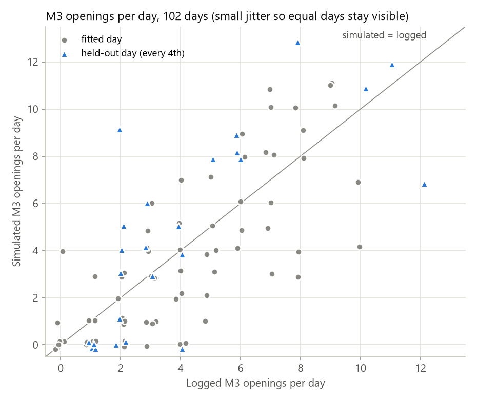
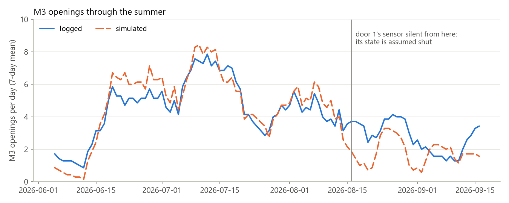
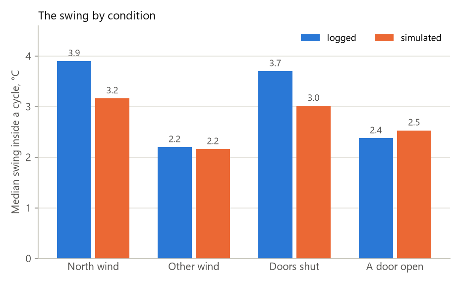
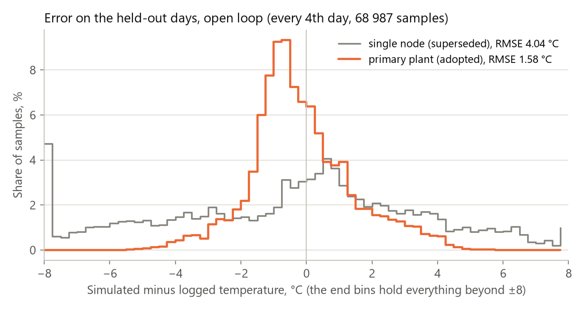
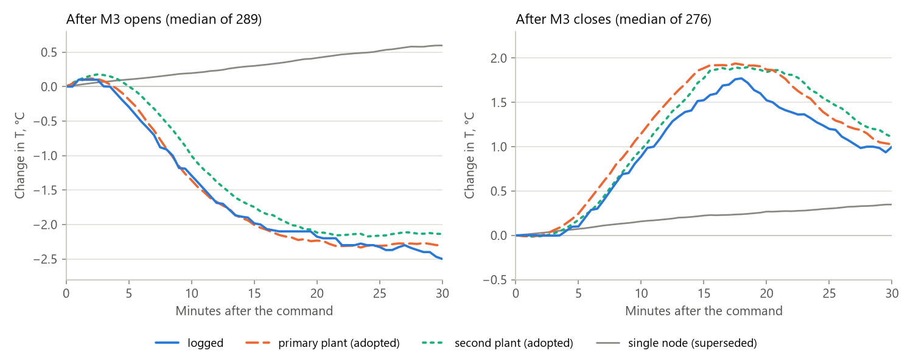
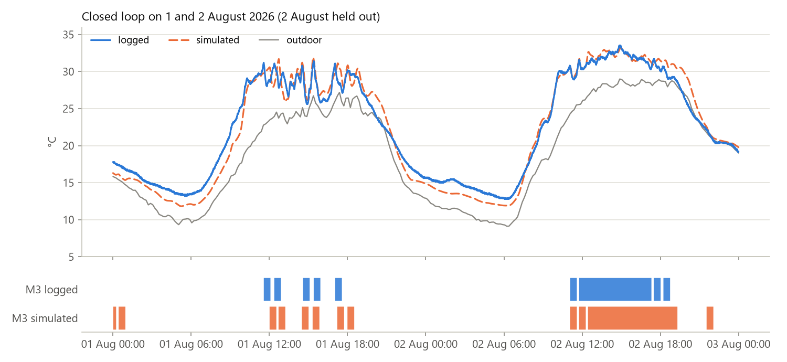

# Model quality: how well the simulator reproduces 5C88

| Field | Value |
|---|---|
| Question | How closely does the closed-loop simulator reproduce what controller 5C88 and its greenhouse did in summer 2026? |
| Model | The adopted two-node plants: [`plant2_summer2026_Ca2.9_tau120_tau90_ev5_dir.json`](../campaign-summer-2026/plant2/plant2_summer2026_Ca2.9_tau120_tau90_ev5_dir.json) (primary) and [`plant2_summer2026_Ca2.9_tau240_tau90_ev5_dir.json`](../campaign-summer-2026/plant2/plant2_summer2026_Ca2.9_tau240_tau90_ev5_dir.json) (second). They run with the stepped law compiled from `drivers/ventModel`, inside the emulated firmware (T2, T3, T4, T5, T6), with 5C88's own settings |
| Data | 5C88's SD logs, 2026-06-05 to 09-16: 102 full days at 30 s, with the LoRa outdoor and door data converted from UTC |
| Computed | 2026-09-19, by [`quality_report.py`](quality_report.py). It recomputes every number and figure on this page |

## Verdict

**The model reproduces the binary law's behaviour well enough to compare control laws** on:
- **how often M3 opens:** 395 against 406 logged;
- **the length of the limit cycle:** 45 against 46 min;
- **the time spent at or above the M3 entry temperature:** 233 against 237 h.

It holds up on the held-out days too, which the fit never saw.

**It under-states the temperature swing inside a cycle:** 2.7 against 3.1 °C overall, and 3.2 against 3.9 °C on north-wind days. The swing is exactly what a linear M3 law sets out to damp. Treat a simulated verdict on swing damping with caution until the NS-9 field tests settle the north-wind effect.

The model is weakest after 16 August: 60 simulated openings against 90 logged. From that date door 1's state is unknown.

## Closed loop

The law, inside the emulated firmware, drives the plant through 5C88's logged weather; the windows are the simulator's own. Wind safety (T3) and day/night (T4) are simulated too. Windows are taken from the log only while an operator had them in an LCD admin session. The held-out days are every 4th day, which the fit never saw.

| | Logged | Simulated (primary) | 25 held-out days, logged / simulated |
|---|---|---|---|
| M3 openings | 406 | 395 (−3 %) | 103 / 120 |
| Correlation of the daily openings | | r = 0.78 | r = 0.77 |
| Days within ±2 openings | | 78 of 102 | 17 of 25 |
| M3 open time | 499 h | 549 h (+10 %) | 133 / 148 h |
| Hours at 31 °C or more (the M3 entry temperature) | 237 h | 233 h | 72 / 75 h |
| Cycle period (median gap between M3 openings) | 46 min | 45 min | 45 / 44 min |
| Days that cycle | 74 | 65 | 17 / 17 |
| Swing inside a cycle (median) | 3.1 °C | 2.7 °C | 3.6 / 2.9 °C |
| Temperature error per day (median RMSE) | | 1.35 °C | 1.44 °C |

**The two adopted plants agree with each other.** The single-node plant they replaced does not reproduce the cycle:

| | Logged | Primary | Second | Single node (superseded) |
|---|---|---|---|---|
| M3 openings | 406 | 395 | 389 | 184 |
| Correlation of the daily openings | | 0.78 | 0.78 | 0.52 |
| Cycle period | 46 min | 45 min | 46 min | 113 min |
| Days that cycle | 74 | 65 | 63 | 13 |
| Swing inside a cycle | 3.1 °C | 2.7 °C | 2.7 °C | 3.9 °C (on 13 days) |
| Temperature error per day | | 1.35 °C | 1.33 °C | 3.55 °C |



*Each dot is one day. A dot on the diagonal is a day the model opened M3 exactly as often as 5C88 did. Held-out days (blue) scatter the same way as fitted days (gray).*



*The model follows the season until mid-August. Before 16 August it makes 335 openings against 316 logged (r = 0.82). From 16 August, when door 1's sensor fell silent and the door is assumed shut, it makes 60 against 90, and cycles on 13 days against 22. The data do not say whether the door is the cause.*



*The swing is right in wind from other directions (2.2 against 2.2 °C) and with a door open (2.5 against 2.4 °C). It is too small in north wind (3.2 against 3.9 °C) and with the doors shut (3.0 against 3.7 °C). North wind is at least half of the day's M3-open time from 315-45°. A door counts as open for at least a fifth of the day.*

## The plant alone

Here the plant is driven by the logged window positions, without the controller, and scored only on the held-out days: 68 987 samples, never used in the fit.

| Held-out days, open loop | Primary | Second | Single node (superseded) |
|---|---|---|---|
| Temperature error, RMSE | 1.58 °C | 1.58 °C | 4.04 °C |
| Within ±1 °C | 52 % | 52 % | 25 % |
| 95th-percentile error | 3.4 °C | 3.4 °C | 7.9 °C |
| Bias | −0.16 °C | −0.18 °C | −0.48 °C |
| Humidity error, RMSE | 8.0 % | 7.9 % | 12.4 % |



**The response to an M3 command** is the sharpest single test of a plant against the limit cycle. It is the median temperature change after each daytime M3 command: 289 openings and 276 closings.

| Change in T, °C | 5 min | 10 min | 15 min | 25 min |
|---|---|---|---|---|
| **After M3 opens:** logged | −0.3 | −1.3 | −2.0 | −2.3 |
| primary | −0.2 | −1.4 | −2.0 | −2.3 |
| second | 0.0 | −1.0 | −1.7 | −2.2 |
| single node | +0.1 | +0.2 | +0.3 | +0.5 |
| **After M3 closes:** logged | +0.1 | +0.9 | +1.5 | +1.2 |
| primary | +0.2 | +1.1 | +1.9 | +1.3 |
| second | +0.2 | +1.0 | +1.8 | +1.5 |
| single node | +0.1 | +0.2 | +0.2 | +0.3 |



*After M3 opens, the primary plant follows the logged curve almost exactly. The second plant, with the longer sensor delay, lags it by a minute or two. After M3 closes, both warm about 0.4 °C too far. The single node gets the direction wrong.*

**Wind direction.** 25 min after M3 opens, the controller's reading has dropped 3.0 °C in north wind and 1.5 °C in other wind, twice as far. The primary plant drops 2.5 and 2.2 °C: it has the direction effect, but not its size. This is where the north-wind swing goes missing.

## An example: 1 and 2 August



**The pair was picked as typical, not as the best.** Its closed-loop temperature error, 1.33 °C, is close to the summer's median of 1.35 °C, and 2 August is a held-out day. The model times the cycle as 5C88 did:
- **1 August:** short M3 openings through the afternoon;
- **2 August:** M3 held open from late morning.

These two nights run about 1-2 °C cool. Over the whole summer the closed-loop bias is smaller: −0.4 °C at night and −0.5 °C by day.

## The controller around the law

**The firmware side of the simulator is checked separately, against 5C88's own rows** (`closed_loop.py`):

| Gate | What it checks | Result |
|---|---|---|
| `gate-control` | Fed the logged readings, the law in the emulated T5 and T6 makes 5C88's decisions | T-demands 97.1 % (13-29 July) and 98.5 % (summer); RH-demands 90.8 % and 88.3 %; whole row 88.7 % and 87.4 % |
| `gate-sun` | `sunrise.cpp` itself, at 5C88's coordinates, makes its SUN rows | 92 of 92, to the minute |
| `gate-wind` | T5's wind averages and T3 make 5C88's wind overrides | 8 of 8; the override state agrees on 99.9997 % of samples |
| `gate-plant` | The plant equations are the calibrator's | to 1.5e-13 °C |

The humidity decisions are the weaker figure. The log keeps RH in whole percent, and 5C88's RH averaging window is still unconfirmed: the model runs 10 min, but the logged decisions fit 5-7 min better ([closedloop/README.md](README.md), "Settings").

## Where it falls short

- **North-wind days: the swing is 3.2 against 3.9 °C.** After M3 opens in north wind, the logged reading drops twice as far as in other wind; the model drops 1.1 times as far. The indoor LoRa sensors show at most 1.2×, so the effect may be local to the controller's probe. NS-9's forced tests, with a second probe, are the next step.
- **M3 stays open too long.** Simulated open time is +10 % overall and +16 % before 16 August, and the held-out days show 17 % more openings.
- **From 16 August, 60 openings against 90.** Door 1's state is unknown from that date; the cause is not established.
- **After M3 closes, the plant warms too far:** 1.9 against 1.5 °C at 15 min.
- **Humidity is the weaker half of the plant:** 8 % RMSE on the held-out days, and the RH window above is unconfirmed.
- **One probe.** Every figure compares with the controller's own sensor, which hangs in the centre of the house. How much of its behaviour is the whole house is open.

## What it is good for

- **Comparing control laws** on the number of M3 movements, the cycle period, the time above a threshold and the M3 open time. Run a law against both adopted plants, and treat a verdict that differs between them as unsettled.
- **Checking settings:** every controller setting can be applied (`--set`, `--config`).
- **Swing damping, the claim a linear M3 law will make:** treat it with caution, especially on north-wind days, where the model starts with too small a swing.

## Regenerating this page

```bash
python model/closedloop/quality_report.py
python model/closedloop/closed_loop.py gate-control
python model/closedloop/closed_loop.py gate-control model/campaign-summer-2026/*.log
python model/closedloop/closed_loop.py gate-sun
python model/closedloop/closed_loop.py gate-wind
```

The first takes about three minutes. It rewrites the figures in [`images/`](images/) and prints every number on this page except the gates, which the other four commands print.
